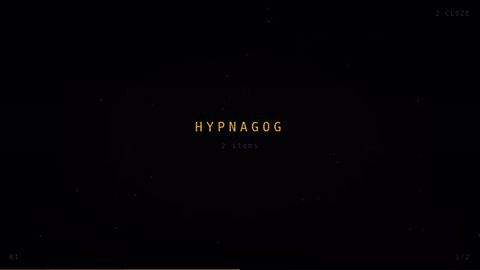

# Anki HTML Exporter

Exports Anki cards to a browsable HTML page in which **every card is rendered
by Anki's own engine** — a card in the export looks the way it looks in the
reviewer. The same dialog serves that page live from the running collection,
reads the cards aloud (**Narrator**, with an OpenAI API key), and plays them
as a rapid presentation (**Hypnagog**).

## Install

From AnkiWeb: **Tools → Add-ons → Get Add-ons…**, code `265861717`. Or build
the `.ankiaddon` with `python3 build_addon.py` and drop it on Anki.

## Four ways to use it

**Tools → Export to HTML…**, or select cards in the browser and use the
context menu. Pick a deck, tags, and optionally an Anki search (`is:due`,
`-tag:leech`, `added:30`); the *Content* tab decides what a card shows.

| Button | What it does | Needs |
|---|---|---|
| **Export** | Writes the page to disk — a folder, or one self-contained file | — |
| **Browse live** | Serves the same page from the running collection, nothing written | — |
| **Narrate** | A narrated slide show: each card told by a language model and read aloud | OpenAI API key |
| **Hypnagog** | A rapid full-screen presentation of the facts | — |

## The page

- **Card sides** — *Auto* (Anki's answer side, plus the question when the
  answer does not repeat it), *Q + A*, *A* or *Q*; for all cards, or per card.
- **Reveal on click** for cloze deletions and image occlusion masks;
  **study mode** shows the front only and reveals on space.
- **Filter** by deck, tag, note type, card state and flag, with counts; a
  search box over text, fields, tags and ids.
- **Info / Details / Fields** — header row, scheduling strip and raw note
  fields, each switchable.
- **Shuffle**, **night mode**, **print** at three densities; on a phone,
  swipe a card away.

Cards are mounted as they come near the viewport and released once past,
so an export of a shared deck stays usable.

**Output.** A folder (`index.html` with `media/`, `css/`, `js/`; MathJax and
jQuery only when a card needs them) or a single `.html` with media inlined.
Media is copied straight out of `collection.media` — audio, video, fonts,
SVG — and `[sound:…]` becomes a player. Remote `http(s)` media is left
alone unless *Download media referenced by URLs* is on.

## Browsing live

**Browse live** serves the collection to your browser while Anki runs: cards
render as you scroll, pictures come out of `collection.media`, and the scope
stays changeable — **Filter…** offers every deck, tag and note type, the
search box is Anki's own, and the decks and tags the dialog was pointed at
arrive as ticks there, so changing them replaces the dialog's choice. Optionally the page can be
reached from your network; **QR** shows the address as a code that carries the
scope you are reading. Anyone with that address can read the whole
collection, so hand it out with care. The server runs until *Stop* or until
the profile closes.

## Narrator

**Narrate** opens the cards of the dialog as a narrated slide show. Each card
is shown as the export shows it, a language model writes a short spoken
telling of it, and text-to-speech reads it. This uses OpenAI's API: enter an
**OpenAI API key** under ⚙ on the page. Each narration is a model call and a
speech call — roughly one to two cents per card with the default models —
and nothing is spent without a key. The key is kept in the add-on's config.

- **Cards** — the dialog's scope, then **Filter…** (decks, tags, note types,
  card states, flags) and any Anki search in the bar, exactly as in the live
  view; browser, learning, creation or random order.
- **Playing** — the front first, the back a few seconds into the narration or
  on Enter; the cloze asked on the card is marked. Length per card 10 s to
  2 min as a ceiling: a thin card stays short. Speed 1×–2× with pitch kept.
- **Language** — the card's own, or one set under ⚙; the voice is directed
  in it. Thirteen voices to choose from.
- **Image occlusion** — the region under the mask is shown to the model, which
  reads the hidden label; the narration is about that structure.
- **Ask** — a microphone and a text line under the narration; the model
  answers from the card, spoken in the same voice.
- **Phone** — ▯ shows a QR code that opens the page over HTTPS on a phone in
  the same network.
- **Export** — ⇩ writes the scope as an audiobook (MP3, a chapter per card)
  or a video (MP4). Needs `ffmpeg`. The dialog says what it would cost first.
- **Cost** — a chip shows today's spend; the settings hold the counts, a daily
  budget, and the price list. Scripts and audio are cached in
  `user_files/cache/`, so a card narrated once costs nothing again.

| Key | |
|---|---|
| Space | play / pause |
| ← → | previous / next card |
| Enter | reveal the back |

## Hypnagog

**Hypnagog** opens the cards of the dialog as a rapid full-screen
presentation in the browser: each fact flashes for an instant, shows — a
cloze target blanked and then revealed in its own colour, an answer fading in
under its question — and fades out; after a round the deck reshuffles. It
starts at once on the dialog's cards with the settings kept; **Options** (top
right, or the O key) opens a sheet over it for the cards (due, new, all,
leeches, failed in the last day or week), how many, how long each shows, the
look (with or without CRT effects and ambient tones) and progressive speed.
Needs no key.

| Key | |
|---|---|
| Space | pause / resume |
| ← → | previous / next |
| ↓ ↑ | dismiss a card / bring it forward |
| 1 2 | clean / Polybius look |
| 3 | cloze blanking on / off |
| F11 | full screen |
| O | options |
| Esc | stop |

## Known limitations

- Image occlusion **text** shapes are placed without measuring the glyphs, so
  a label's plate can sit a pixel or two off; rectangles, ellipses and
  polygons are exact.
- Media that a template's JavaScript builds at runtime cannot be discovered
  and is not copied.
- Other add-ons affect the export only with *Let add-ons post-process cards*
  on, and hooks written for the reviewer may inject controls that do nothing
  outside Anki.

## Requirements

| | |
|---|---|
| Anki | 2.1.50 or later; AnkiConnect is not needed |
| Narrator | an OpenAI API key; `ffmpeg` for its exports |
| Everything else | nothing beyond Anki |
