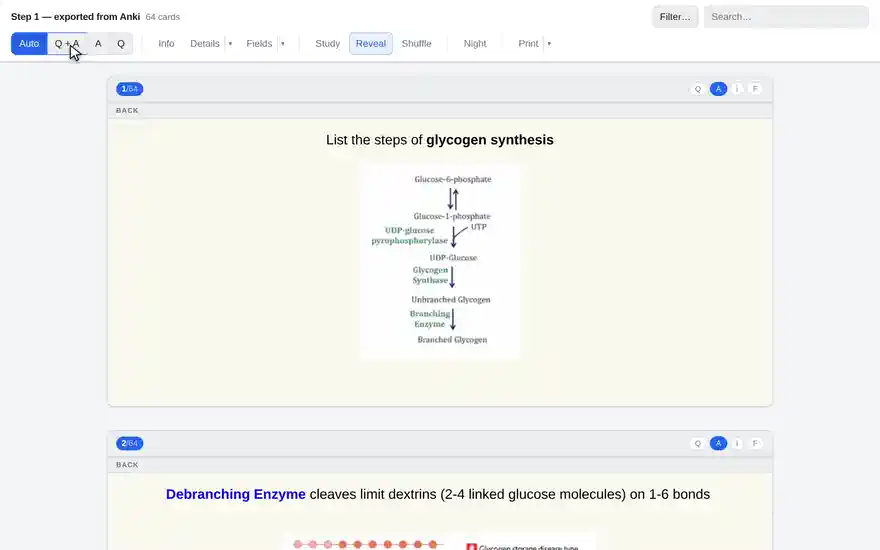
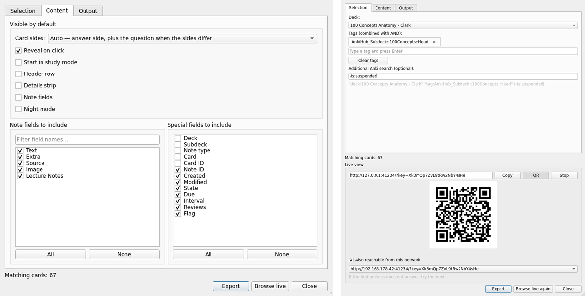

# Anki HTML Exporter

Exports Anki cards to a browsable HTML page in which **every card is rendered by
Anki's own engine** — so a card in the export looks the way it looks in the
reviewer. The same dialog can also serve that page live out of the running
collection, without writing anything.





## Install

From AnkiWeb: **Tools → Add-ons → Get Add-ons…**, code `265861717`. Or build the
`.ankiaddon` yourself (see below) and drop it on Anki.

## Use it

**Tools → Export to HTML…**, or select cards in the browser and use the context
menu. Pick a deck, any number of tags, and optionally an Anki search
(`is:due`, `-tag:leech`, `added:30`); the *Content* tab decides what a card
shows. **Export** writes the page, **Browse live** opens the same cards in your
browser without writing anything.

## What the page does

- **Card sides**: *Auto* (Anki's answer side, plus the question for cards whose
  answer does not repeat it), *Q + A*, *A* or *Q* — for every card at once, or
  per card from the chips in its header.
- **Reveal on click** for cloze deletions and image occlusion masks.
- **Study mode**: only the front is shown, space reveals, arrow keys walk the
  stack.
- **Filter…**: deck and tag trees, note types, card states and flags, each with
  a count. Plus a search box over card text, fields, tags and IDs.
- **Info / Details / Fields**: the card's header row, its scheduling strip and
  the raw note fields — each switchable, and each with a list to choose what it
  holds.
- **Shuffle**, **Night mode**, and **Print**, which lays the cards out for paper
  at one of three densities, scaling each card as a whole so none is torn
  between columns.

Cards are mounted as they come near the viewport and released again once they
are well past, at most forty at a time — which is what lets an export of a
shared deck stay usable. What you have uncovered comes back when a card is
built again.

## Browsing live

**Browse live** serves the collection to your browser while Anki runs. Nothing
is written anywhere: cards render as you scroll and pictures come out of
`collection.media`. It is the same page as the export, so everything above
works — but the scope stays changeable, and it is the *whole* collection: the
deck box in the bar reaches every deck there is, the filter panel offers every
tag and note type, and the search box is Anki's own.

Optionally the page can be reached from your own network, so a phone or a second
computer can read along. **QR** then shows the address as a code, in the dialog
and in the page itself; it carries the scope you are reading, so the phone opens
where you are. Anyone with that address can read the whole collection, so hand
it out the way you would hand out the collection itself. Nothing the view serves
writes to your collection.

The server keeps running when the dialog is closed; *Stop* ends it, and so does
closing the profile.

## Output and media

- **Folder** (default): `index.html` plus `media/`, `css/`, `js/`. MathJax
  (~1.7 MB) and jQuery are copied in only when a card needs them.
- **Single file**: one self-contained `.html` with media as `data:` URIs.

Media is copied straight out of `collection.media`, so audio, video, fonts and
SVG survive, not just images; `[sound:…]` becomes a real player. `http(s)`
references are left alone unless *Download media referenced by URLs* is on —
the one part of the add-on that talks to anything but your own machine, and off
by default.

## Known limitations

- Image occlusion **text** shapes are placed without measuring the glyphs the
  way the reviewer's canvas does, so a label's plate can sit a pixel or two off.
  Rectangles, ellipses and polygons are exact.
- Media that a template's JavaScript builds at runtime (`src="${url}"`) cannot
  be discovered, and is therefore not copied.
- Other add-ons only affect the export if *Let add-ons post-process cards* is
  enabled, and hooks written for the reviewer may inject controls that do
  nothing outside Anki.
- The live view's filter panel offers decks, tags and note types — not card
  states or flags.

## Building and tests

```
python3 build_addon.py            # both .ankiaddon files into dist/
python3 build_addon.py --tailwind # regenerate the panel's stylesheet (needs Node)
python3 tests/run.py              # the page in headless Chromium (needs Chromium)
python3 tests/dialog_probe.py     # the Qt dialog, outside Anki (needs Anki's aqt)
```

The build refuses a payload whose versions disagree, whose assets are missing or
whose generated stylesheet no longer matches the markup. `ahe/web/tailwind.css`
is committed, so a normal build needs nothing but Python.

## Requirements

Anki 2.1.50 or later. **AnkiConnect is not required** — the add-on works
directly with the collection, which is what gives it the real rendering engine.
