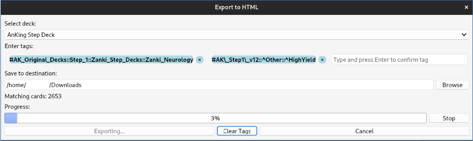

# Anki Cards to HTML Exporter

Export Anki notes to readable HTML using filters like tags or deck names.



## Features

- Export notes to HTML via:
  - **Deck name**
  - **Multiple tags**
- Live card count updates when filters change
- Visual feedback during export (progress bar + cancel support)
- Automatically creates an output folder:
  ```
  [Selected Folder]/Anki_Export_[Deck]_Tag1_Tag2
  ```
- Clean and readable HTML output, ideal for:
  - Teaching materials
  - Review sessions
  - Note backups

## Requirements

- **Anki 25.02 or later**
- **AnkiConnect add-on (required for performance)**  
  The plugin uses AnkiConnect's fast API to query cards without blocking the UI.

## How to Use

1. Go to `Tools > Export to HTML (Deck/Tag)`
2. Select a deck and/or tags
3. Choose output location
4. Click **Export**

## Automated Testing

A headless test script is available to validate plugin functionality in /export_test_runner:

- Opens the export dialog
- Chooses a random deck/tag
- Executes export
- Verifies and removes the result

